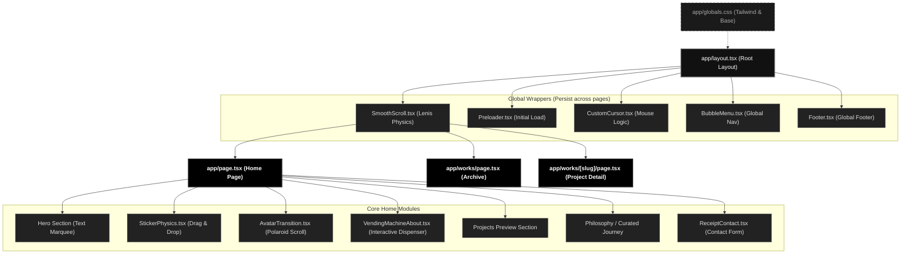

# Portfolio Architecture & Workflow

Here is the complete architectural map of your interactive portfolio! It breaks down exactly how the Next.js App Router connects your pages, global wrappers, and interactive components together.

## Application Architecture Diagram

## Component Breakdown

### 1. Global System Elements (Live Everywhere)
* **`app/layout.tsx`**: The master file. It wraps every page in your application with the essential global elements.
* **`SmoothScroll.tsx`**: Injects Lenis scrolling physics into the app so that regular scrolling feels buttery smooth and inert.
* **`CustomCursor.tsx`**: Tracks the user's mouse globally, replacing the default cursor and enabling the "click to stamp" effect.
* **`Preloader.tsx`**: The initial 5-second loading animation that blocks the UI until assets are ready.
* **`BubbleMenu.tsx`**: The persistent, floating navigation menu at the bottom of the screen.

### 2. Core Interactive Modules (Home Page)
* **`StickerPhysics.tsx`**: Uses `framer-motion` to handle the drag-and-throw interactions for the physics items floating around the hero section.
* **`AvatarTransition.tsx`**: A highly complex scroll-linked animation that uses `position: sticky` to transition an image from a small polaroid into a massive full-screen dark room.
* **`VendingMachineAbout.tsx`**: Handles the logic for the interactive keypad and dispenses "about me" facts dynamically based on user input.
* **`ReceiptContact.tsx`**: Uses an SVG mask and CSS filters to render your contact section as a printed receipt rolling out of a machine.

### 3. The Routing System
Next.js 14 handles routing automatically via folders:
* `/` -> Resolves to `app/page.tsx`
* `/works` -> Resolves to `app/works/page.tsx` (Your grid of past projects).
* `/works/[slug]` -> Dynamic routing. Automatically resolves URLs like `/works/twogoodco` to the dynamic page template defined in `app/works/[slug]/page.tsx`.
